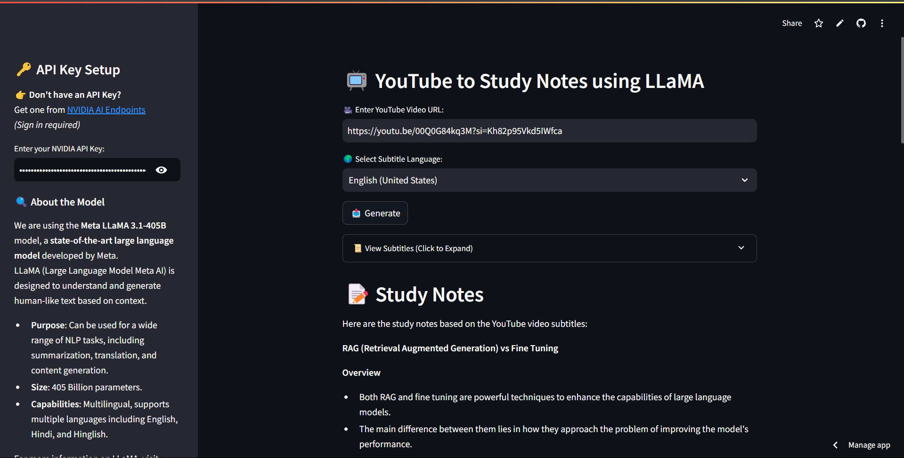

# 🎬 **Youtube To Study Notes using LLaMa**

A **Streamlit-based web application** that extracts **YouTube video subtitles** and generates **study notes** using the **LLaMa** language model by Meta. The application helps users get summarized and structured study notes from YouTube educational videos in various languages, including **English, Hindi**, and **Hinglish**.

---

## Table of Contents
- [Introduction](#introduction)
- [Features](#features)
- [Installation](#installation)
- [Usage](#usage)
- [Use Case](#use-case)
- [Screenshots](#screenshots)
- [Contributing](#contributing)
- [License](#license)

---

## Introduction

**Youtube To Study Notes using LLaMa** is a web application that allows users to input a YouTube video URL and fetch subtitles from the video. Once the subtitles are fetched, the app uses the **LLaMa model** to generate study notes, making learning easier and more efficient.

The application uses **Streamlit** for the UI and integrates with NVIDIA's **LLaMa API** to generate study notes from the extracted subtitles. This project supports multiple languages like **English**, **Hindi**, and **Hinglish**.

---

## Features
- Extract subtitles from YouTube videos in various languages.
- Use the **LLaMa** language model to summarize and generate study notes.
- User-friendly Streamlit interface.
- Allows downloading the subtitles in **PDF** or **Text** format.
- Supports inputting **API keys** for using the NVIDIA AI endpoints.

---

## Installation

To run the project on your local machine, follow these steps:

1. Clone the repository:
   ```bash
   git clone https://github.com/abhi227070/Youtube-to-Study-Notes.git
2. Change the directory to the project folder:
   ```bash
   cd Youtube-to-Study-Notes
3. Install the required dependencies:
   ```bash
   pip install -r requirements.txt


This part explains how to clone the repository, install the dependencies, and set up the project to run locally. Let me know if you need any further adjustments!

---

## Usage

After setting up the project, you can run the application by following these steps:

1. Run the Streamlit app:
   ```bash
   streamlit run app.py

2. The application will start, and you can access it in your web browser.
3. Enter the YouTube video URL: Paste the link of any educational YouTube video in the provided input field.
4. Select Subtitle Language: Choose the language for subtitles (e.g., English, Hindi, Hinglish).
5. Fetch Subtitles: Click the "Fetch Subtitles" button to retrieve the subtitles from the YouTube video.
6. View Subtitles & Study Notes: The app will display the subtitles and generate a summarized study note based on the content of the video.
7. Download Options: You can download the subtitles and the study notes in either Text or PDF format.

---

## Use Case

This project is ideal for students, teachers, and anyone looking to convert **YouTube educational videos** into **summarized study notes**. Some key use cases include:

- **Summarizing educational videos**: Helps in creating concise study notes from long YouTube videos.
- **Language Learning**: Converts bilingual subtitles into study notes.
- **Content Creators**: Allows creators to convert their videos into useful, structured summaries for their audience.

---

## Screenshots

Here is screenshot of the application:

**Main Interface with Subtitle Input**:
   

---

## Contributing

We welcome contributions! If you'd like to contribute to this project, please follow these steps:

1. Fork the repository.
2. Create your feature branch (`git checkout -b feature-name`).
3. Commit your changes (`git commit -m 'Add some feature'`).
4. Push to the branch (`git push origin feature-name`).
5. Open a pull request.

---

## License

This project is licensed under the MIT License - see the [LICENSE](LICENSE) file for details.
